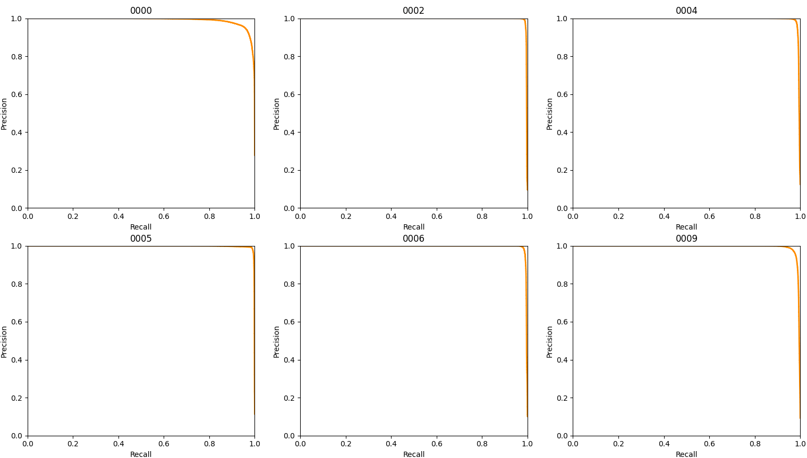

# SSC
Code for IROS2021 paper [SSC: Semantic Scan Context for Large-Scale Place Recognition](https://arxiv.org/abs/2107.00382)


## Citation

```
@misc{li2021ssc,
      title={SSC: Semantic Scan Context for Large-Scale Place Recognition}, 
      author={Lin Li and Xin Kong and Xiangrui Zhao and Tianxin Huang and Yong Liu},
      year={2021},
      eprint={2107.00382},
      archivePrefix={arXiv},
      primaryClass={cs.CV}
}
```

## Requirements
[OpenCV](https://opencv.org/)  
[PCL](https://pointclouds.org/)  
[yaml-cpp](https://github.com/jbeder/yaml-cpp) 

## Usage
Build the code:
```bash
    mkdir build && cd build && cmake .. && make -j5
```
Modify the [configuration file](https://github.com/lilin-hitcrt/SSC/blob/main/config/config_kitti.yaml).

A simple example:
```bash
    cd ../bin
    ./eval_pair
```
Precision-Recall:

```bash
    cd ../bin
    ./eval_seq
```
Top-k Recall:

```bash
    cd ../bin
    ./eval_top1
```
[plot curve](./script/README.md)

## Data
### Pair Lists
[pairs](https://drive.google.com/file/d/1Y540LJFZHiaAooUX2KtxNIQhw-kzy7gQ/view?usp=sharing)

### Semantic label for KITTI-360
[label](https://drive.google.com/file/d/1QvPw--pfikvWrWNP_tWfxxCawUf7IdEb/view?usp=sharing)

## Results
### KITTI
#### Top-k Recall
When using 5 m as the threshold, the top-k recall rate is shown in the figure:


#### Precision-Recall Curve
The Precision-Recall curve when α=100:


### KITTI-360
#### Precision-Recall Curve
The Precision-Recall curve when α=10:



## Acknowledgement

Thanks to the source code of some great works such as [Scan Context](https://github.com/irapkaist/scancontext) and [Intensity Scan Context](https://github.com/wh200720041/iscloam)